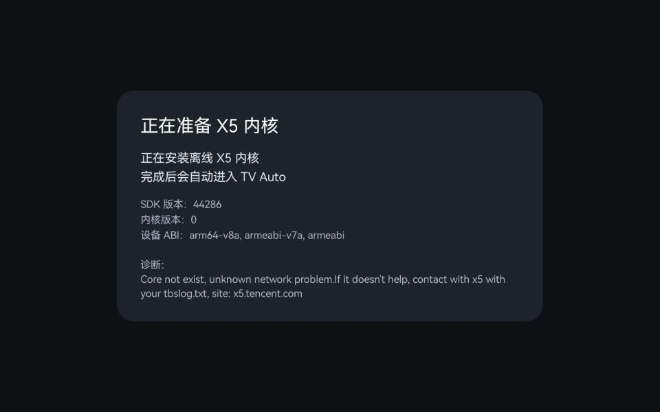
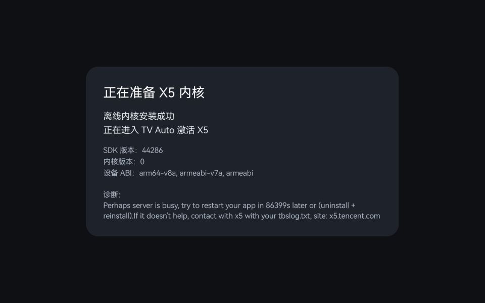
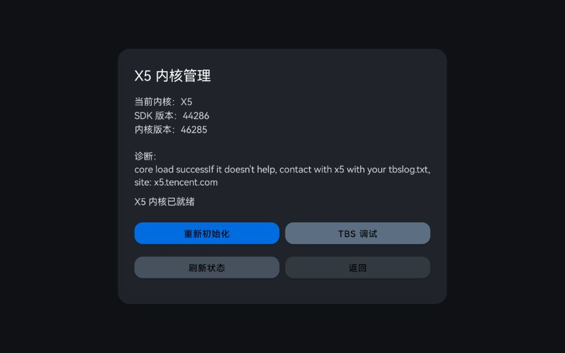

# TV Auto X5

TV Auto X5 是 TV Auto 的兼容分支，面向系统 WebView 较旧、网页播放能力较弱的设备。它保留标准版的主要能力，并额外内置腾讯 TBS X5 离线内核，用于改善部分老旧设备上的网页兼容性。

当前版本：**v6.0-x5**  
标准版见 [TV Auto 主分支](https://github.com/ymlyyy/TVAuto)。

---

## 与标准版的关系

| 版本 | 推荐场景 |
| --- | --- |
| TV Auto | 默认推荐，体积更小，依赖系统 WebView，适合大多数设备 |
| TV Auto X5 | 当系统 WebView 太旧、网页打不开或无法播放时再尝试，安装包更大 |

两个版本使用不同包名，可以同时安装，互不覆盖。  
如果标准版已经能稳定使用，通常没有必要改用 X5 版。

---

## X5 分支额外提供

- 内置离线 X5 core，不依赖首次联网下载
- 同时内置 32 位和 64 位 ARM core，启动时按设备 ABI 自动选择
- 首次启动时自动完成 X5 准备流程
- 提供 `X5 管理` 页面，可查看当前实际内核状态并进行调试
- 与标准版可共存，便于在同一设备上直接对比效果

> X5 主要解决兼容性问题，不代表所有网站都会因此可播放。网页本身的登录限制、站点策略和播放器实现，仍然可能影响最终结果。

---

## 首次启动 X5

首次打开 X5 版时，应用会自动准备离线内核，并完成后续激活流程。

准备完成后，可在 `X5 管理` 页面确认当前实际使用的内核。如果显示 `当前内核：X5`，说明已经切换成功。

---

## v6.0-x5 更新

- 在 v6.0 功能基础上新增 X5 兼容分支
- 内置离线 X5 core，并按设备 ABI 自动选择
- 新增首次启动自动准备流程与 X5 管理页面
- 修复 X5 获得焦点后出现的遮罩问题
- 同步标准版的网页管理、用户脚本、原始网页模式与加载提示优化

---

## 使用须知

- 默认频道仅作示例用途，不保证长期可用，也不保证适用于所有地区
- 请自行核实并添加合规频道
- TV Auto X5 只负责整理和展示用户访问的网页内容，不提供直播内容本身
- 使用过程中请遵守当地法律法规

---

## 反馈与支持

如果标准版无法正常播放，而 X5 版改善了你的设备兼容性，欢迎反馈设备型号和使用情况，便于后续继续优化。

  

