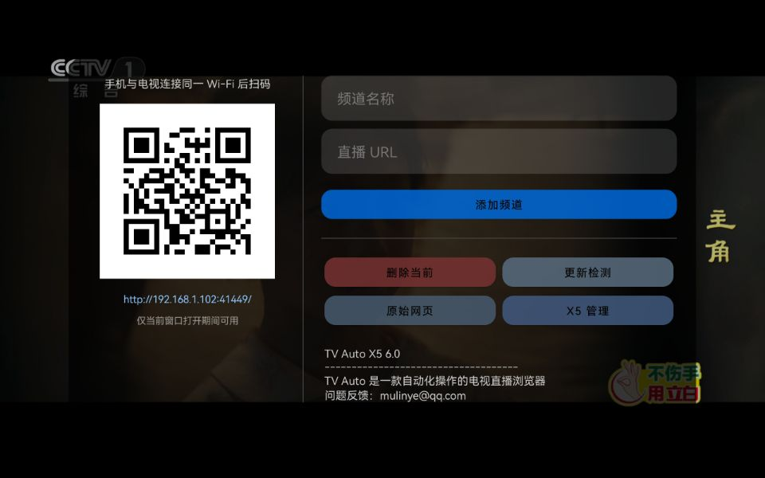
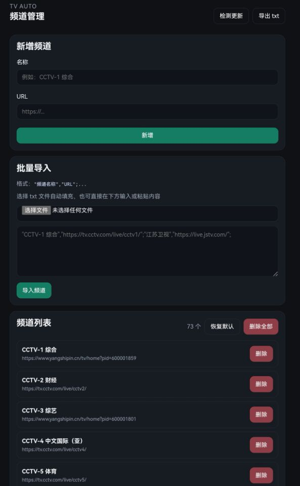
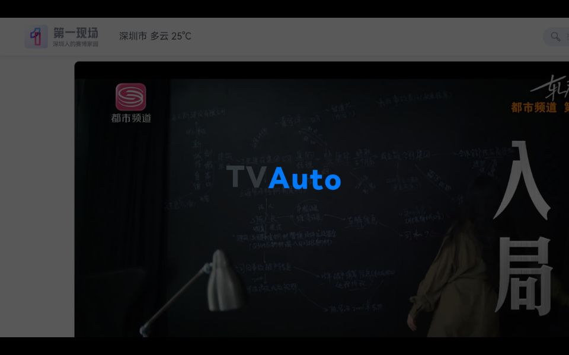
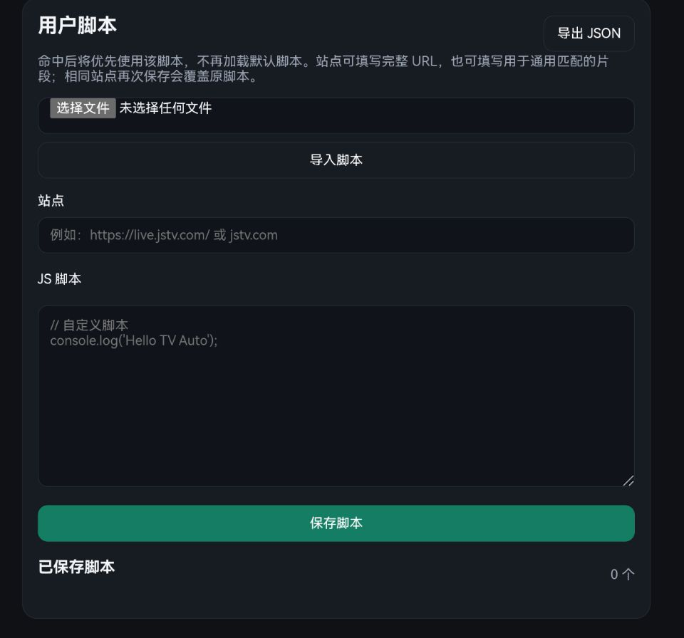
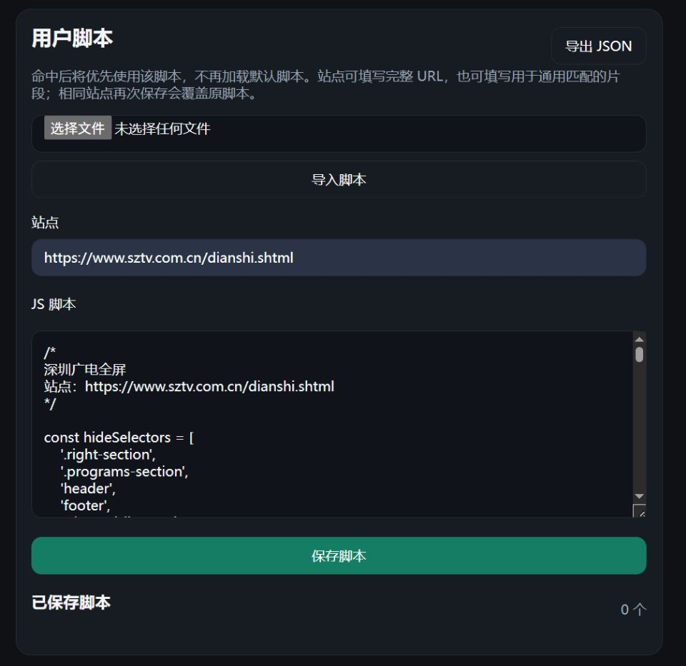

# TV Auto X5

TV Auto X5 是 TV Auto 的兼容分支，面向系统 WebView 较旧、网页播放能力较弱的设备。它保留标准版的主要能力，并额外内置腾讯 TBS X5 离线内核，用于改善部分老旧设备上的网页兼容性。

当前版本：**v6.0-x5**  
标准版见 [TV Auto 主分支](https://github.com/ymlyyy/TVAuto)。

---

## 与标准版的关系

| 版本 | 推荐场景 |
| --- | --- |
| TV Auto | 默认推荐，体积更小，依赖系统 WebView，适合大多数设备 |
| TV Auto X5 | 当系统 WebView 太旧、网页打不开或无法播放时再尝试，安装包更大 |

两个版本使用不同包名，可以同时安装，互不覆盖。  
如果标准版已经能稳定使用，通常没有必要改用 X5 版。

---

## X5 分支额外提供

- 内置离线 X5 core，不依赖首次联网下载
- 同时内置 32 位和 64 位 ARM core，启动时按设备 ABI 自动选择
- 首次启动时自动完成 X5 准备流程
- 提供 `X5 管理` 页面，可查看当前实际内核状态并进行调试
- 与标准版可共存，便于在同一设备上直接对比效果

> X5 主要解决兼容性问题，不代表所有网站都会因此可播放。网页本身的登录限制、站点策略和播放器实现，仍然可能影响最终结果。

---

## 首次启动 X5

首次打开 X5 版时，应用会自动准备离线内核，并完成后续激活流程。


准备完成后，可在 `X5 管理` 页面确认当前实际使用的内核。如果显示 `当前内核：X5`，说明已经切换成功。


---

## 标准能力

X5 分支保留标准版的主要使用方式：

- 内置默认频道
- 支持遥控器、键盘和触摸屏
- 支持局域网页面管理
- 支持频道批量导入与导出
- 支持用户脚本
- 支持原始网页模式


打开频道管理后，左侧同样会显示二维码和局域网地址；X5 版会额外提供 `X5 管理` 入口。



手机、平板或电脑都可以通过浏览器完成频道整理：



---

## 用户脚本

默认脚本已经可以处理一批常见页面，但它并不试图覆盖所有站点。遇到结构特殊的页面，可以直接为该站点添加专属脚本。



在网页管理页中添加脚本时，站点既可以填写完整 URL，也可以填写域名或 URL 片段；当前页面命中后，会优先执行用户脚本，而不是默认脚本。






脚本生效后，同一站点可以按自己的规则重新适配：


示例脚本见 [`docs/examples/shenzhen-tv-script.js`](docs/examples/shenzhen-tv-script.js)。

---

## 原始网页模式

有些网站要求登录后才能观看。TV Auto X5 不尝试绕过站点自身规则，而是提供原始网页模式，让页面在需要时回到网站本来的样子。


进入方式：

- 全屏播放时连续按两次左键
- 或在频道管理窗口中点击 `原始网页`

进入后，页面顶部会常驻提示：`当前为原始网页，按返回回到播放`


> 原始网页模式更适合触屏或接入鼠标后使用。复杂网页通常不适合只靠遥控器完成操作。

---

## 数据格式

频道导入和导出均使用纯文本 `.txt`，每个频道以英文分号结尾：

```txt
"频道名称","频道地址";
```

示例：

```txt
"CCTV-1 综合","https://tv.cctv.com/live/cctv1/";"江苏卫视","https://live.jstv.com/";
```

完整示例见 [`docs/examples/channels.txt`](docs/examples/channels.txt)。

---

## 遥控器操作

| 按键 | 功能 |
| --- | --- |
| 上 / 下 | 切换上一频道 / 下一频道 |
| OK / 右 | 打开右侧频道列表 |
| 左 | 连续按两次进入原始网页模式 |
| 菜单 | 打开频道管理 |
| 数字键 | 直接输入频道号 |
| 返回 | 播放模式下双击退出；原始网页模式下返回播放 |

---

## v6.0-x5 更新

- 在 v6.0 功能基础上新增 X5 兼容分支
- 内置离线 X5 core，并按设备 ABI 自动选择
- 新增首次启动自动准备流程与 X5 管理页面
- 修复 X5 获得焦点后出现的遮罩问题
- 同步标准版的网页管理、用户脚本、原始网页模式与加载提示优化

---

## 使用须知

- 默认频道仅作示例用途，不保证长期可用，也不保证适用于所有地区
- 请自行核实并添加合规频道
- TV Auto X5 只负责整理和展示用户访问的网页内容，不提供直播内容本身
- 使用过程中请遵守当地法律法规

---

## 反馈与支持

如果标准版无法正常播放，而 X5 版改善了你的设备兼容性，欢迎反馈设备型号和使用情况，便于后续继续优化。

<div align="center">
  
</div>
